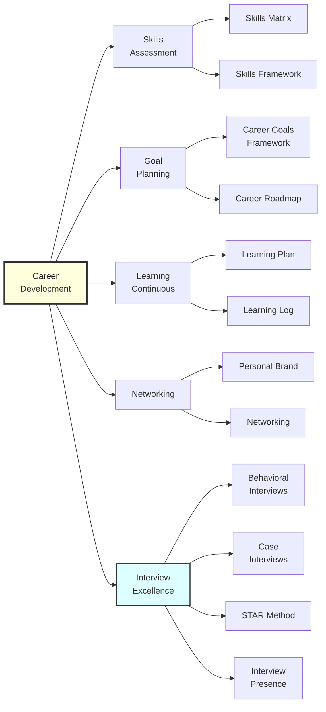
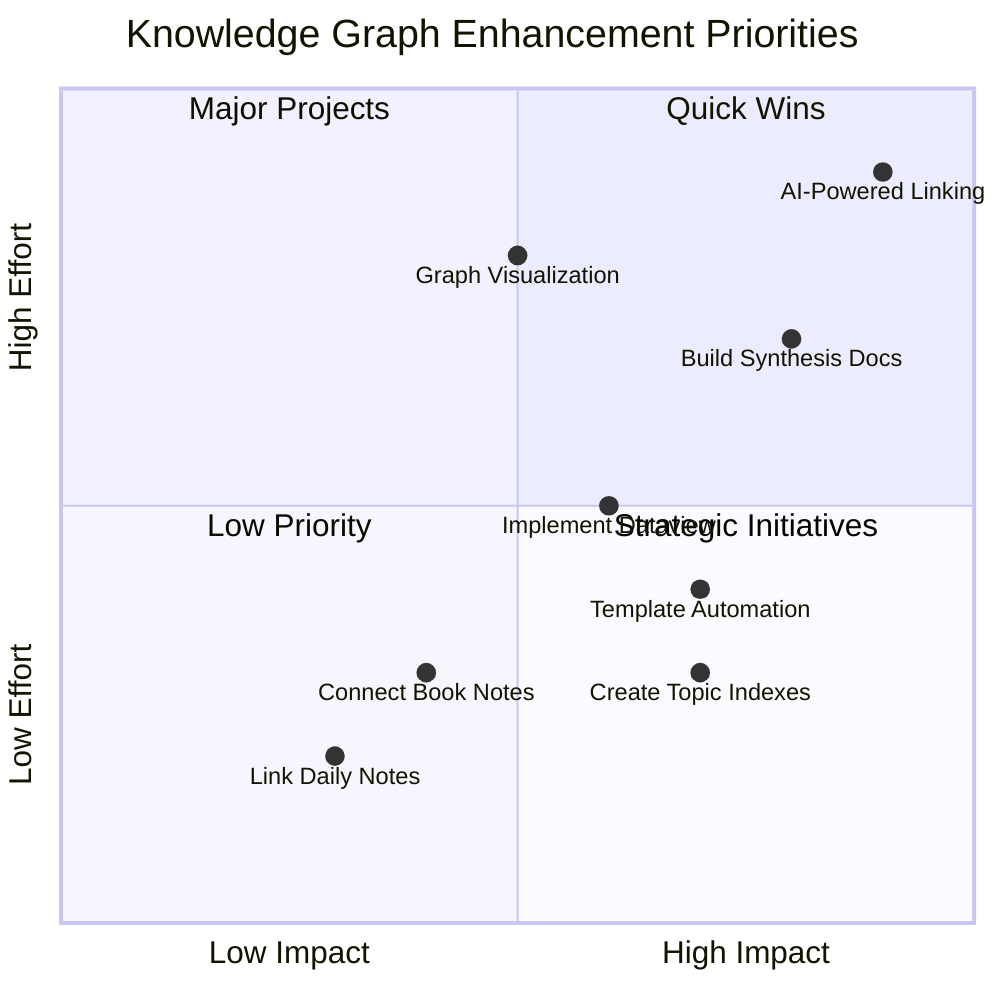

# Knowledge Graph Visual Maps

Visual representations of the major knowledge clusters and their connections in this digital garden.

## Master Knowledge Map

```mermaid
graph TB
    KM[Knowledge Map<br/>Central Hub]

    %% Main Domains
    KM --> LD[ Learning &<br/>Development]
    KM --> PG[ Professional<br/>Growth]
    KM --> HW[ Health &<br/>Wellness]
    KM --> PS[ Productivity<br/>Systems]
    KM --> KS[ Knowledge<br/>Systems]

    %% Learning Cluster
    LD --> SM[Skills Matrix]
    LD --> LA[Learning Atlas]
    LD --> DP[Deliberate Practice]
    LD --> AL[Active Learning]
    LD --> SDH[Skills Development Hub]

    %% Professional Cluster
    PG --> CM[Career Map]
    PG --> LS[Leadership Skills]
    PG --> CS[Communication Skills]
    PG --> IPH[Interview Prep Hub]
    PG --> PWH[Professional Writing Hub]

    %% Health Cluster
    HW --> HM[Health Map]
    HW --> SL[Sleep]
    HW --> EX[Exercise]
    HW --> NT[Nutrition]
    HW --> MH[Mental Health]

    %% Productivity Cluster
    PS --> PSH[Productivity Systems Hub]
    PS --> GTD[Getting Things Done]
    PS --> BJ[Bullet Journal]
    PS --> AH[Atomic Habits]
    PS --> FL[Flow States]

    %% Knowledge Systems Cluster
    KS --> DG[Digital Gardening]
    KS --> ZK[Zettelkasten]
    KS --> PSum[Progressive Summarization]
    KS --> KO[Knowledge Organization]

    %% Cross-Domain Connections
    DP -.-> FL
    CS -.-> LS
    AH -.-> HW
    LA -.-> KO
    SM -.-> CM

    style KM fill:#f9f,stroke:#333,stroke-width:4px
    style SDH fill:#bbf,stroke:#333,stroke-width:2px
    style IPH fill:#bbf,stroke:#333,stroke-width:2px
    style PWH fill:#bbf,stroke:#333,stroke-width:2px
    style PSH fill:#bbf,stroke:#333,stroke-width:2px
```



## Career Development Network



## Knowledge Synthesis Web

```
                    ┌─────────────────┐
                    │ Knowledge       │
                    │ Synthesis       │
                    └────────┬────────┘
                             │
        ┌────────────────────┼────────────────────┐
        │                    │                    │
        ▼                    ▼                    ▼
┌───────────────┐    ┌───────────────┐    ┌───────────────┐
│ Learning +    │    │ Productivity  │    │ Leadership +  │
│ Career Dev    │    │ + Health      │    │ Communication │
└───────┬───────┘    └───────┬───────┘    └───────┬───────┘
        │                    │                    │
        ▼                    ▼                    ▼
   Growth Loop         Performance         Influence
   Framework           Integration         Mastery
```

## Note Maturity Distribution

```
Evergreen ████████████████████ 40%
Seedling ████████████ 25%
Seed ████████ 15%
Untagged ██████████ 20%
```

## Connection Density Map

### High Density Areas (>10 connections)

- Knowledge Map
- Career Map
- Health Map
- Skills Development Hub
- [[Interview Preparation Hub]]

### Medium Density Areas (5-10 connections)

- Leadership Skills
- Communication Skills
- Learning Atlas
- Digital Gardening
- Productivity Systems Hub

### Growth Areas (<5 connections)

- Daily Notes
- Book References
- Project Notes
- Template Files

## Domain Interaction Matrix

| Domain           | Learning | Career | Health | Productivity | Knowledge |
| ---------------- | -------- | ------ | ------ | ------------ | --------- |
| **Learning**     | Core     | High   | Medium | High         | High      |
| **Career**       | High     | Core   | Low    | Medium       | Medium    |
| **Health**       | Medium   | Low    | Core   | High         | Low       |
| **Productivity** | High     | Medium | High   | Core         | High      |
| **Knowledge**    | High     | Medium | Low    | High         | Core      |

## Implementation Priority Map



## Growth Trajectory

```
Month 1: Foundation
├── Create hub notes (done)
├── Link orphaned notes (done)
└── Establish routines (done)

Month 2: Expansion
├── Deepen connections
├── Add synthesis notes
└── Implement tools

Month 3: Optimization
├── Automate workflows
├── Refine structure
└── Measure impact

Month 4+: Evolution
├── Emergent patterns
├── Advanced synthesis
└── Knowledge creation
```

## Visual Legend

- **Solid Lines**: Direct connections
- **Dotted Lines**: Indirect/weak connections
- **Bold Borders**: Hub notes
- **Colors**:
  - Purple: Central hubs
  - Blue: Domain hubs
  - Yellow: Active development
  - Green: Stable/evergreen

---

_Use these visual maps to navigate and understand the structure of your knowledge garden. Update regularly as the graph evolves._
